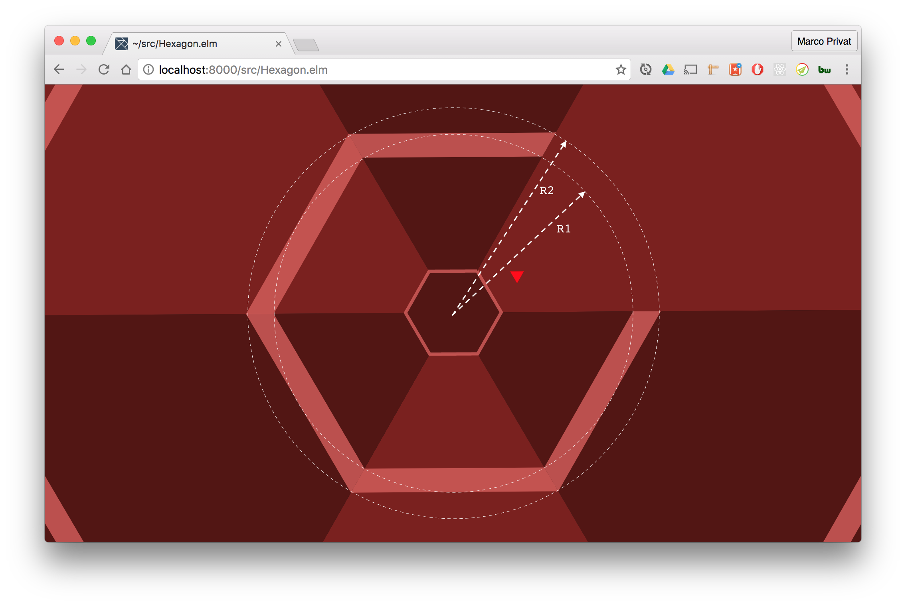

Collision Detection
-------------------

We already introduced a `isGameOver` function, but it returns always false.
The first and only rule for __game over__ in this game is that the game is over when the player collides with any enemy.

We therefore need to write a collision detection. The enemies are composed out of trapezoids. In order to keep it simple we assume that the enemies are sectors of a circle, because that is much easier to work with.

We assume that the player collides with an enemy if the player's angle is inside the segment of the enemey, if enemy's inner radius (R1) is smaller than the player's radius (plus it's height) and if the enemy's outer radius (R2) is still
larger than the player's radius:



With this function we can extend our `isGameOver` rule:



Now we have a real game!

== Small Gameplay Tweak

In the original game you are not able to rotate into an enemy sideways.
Without any modification, it is game over in our version of the game if The player rotates into an enemy.
To prevent this we update the `updatePlayer` function.
We do not update the player's angle, as he would collide with an enemy after rotation:


